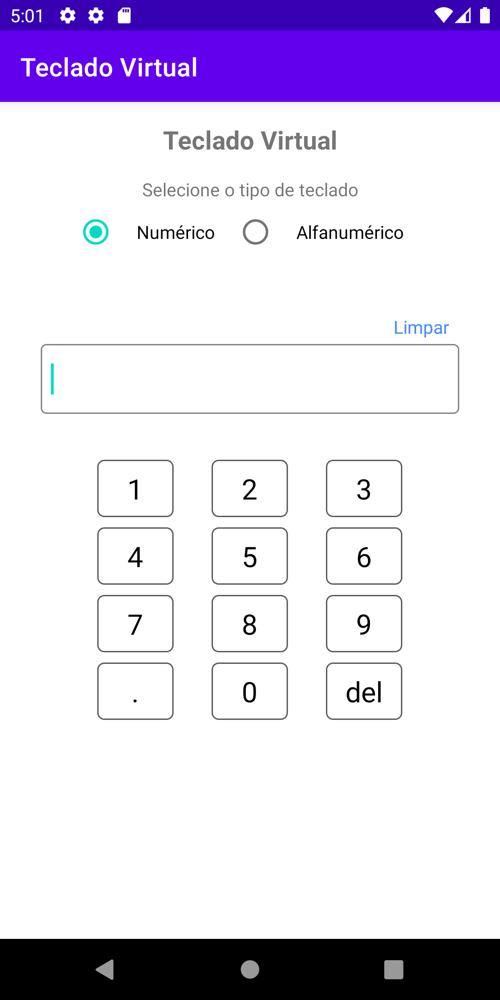
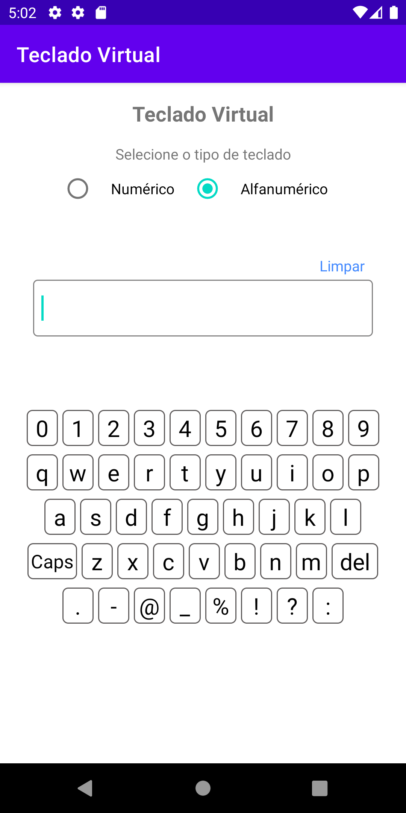

# virtual_keyboard

<h1 align="center">
<a>Teclado Virtual</a>
</h1>

🚀 Aplicativo que fornece a implementação de dois tipos de teclado virtual. O objetivo principal de aplicativo é servir como base de código para ser usado no desenvolvimento de outros aplicativos se houver a necessidade de incluir está funcionalidade. 

<h1 align="center">
  
  
</h1>
